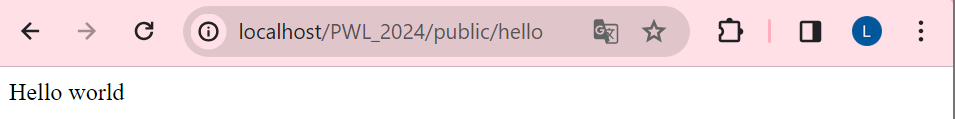
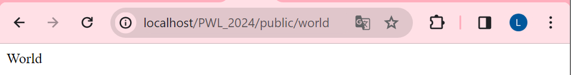
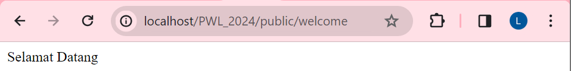
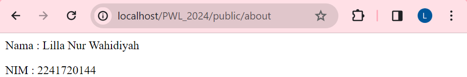
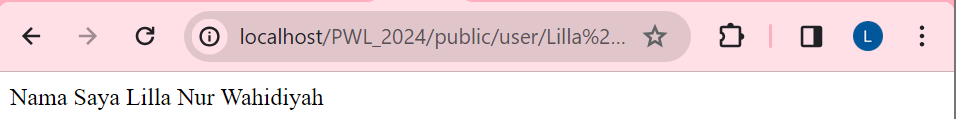
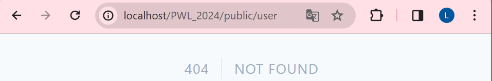
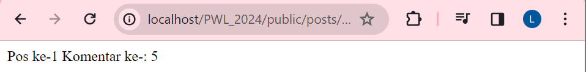
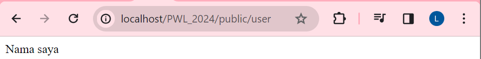
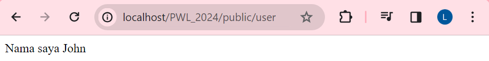

# Laporan Jobsheet 2
## Nama : Lilla Nur Wahidiyah
## NIM  : 2241720144
## Kelas: TI 2 F
## No   : 17
-------------------------------------------------------------


### BASIC ROUTING
localhost/PWL_2024/public/hello
</p>hasil :

</p></p>

localhost/PWL_2024/public/world
</p>hasil :

</p></p>

localhost/PWL_2024/public/welcome
</p>hasil :

</p></p>

localhost/PWL_2024/public/about
</p>hasil :

</p></p>

### ROUTE PARAMETERS

localhost/PWL_2024/public/user/Lilla Nur Wahidiyah
</p>hasil :

</p></p>
Berdasarkan pengamatan saya, dalam kode

```
Route::get('/user/{name}', function ($name) {
return 'Nama saya '.$name;
});
```
 * /user/{name}
 
 Ini adalah pola URL yang dicocokkan oleh route. Bagian di dalam kurung kurawal, {name}, adalah parameter dinamis yang menangkap nilai dari URL.

* function ($name) { ... }

Ini adalah closure (fungsi anonim) yang bertindak sebagai route handler. Closure ini menerima satu argumen, $name, yang sesuai dengan nilai yang diambil dari parameter URL.

* return 'Nama saya '.$name;

Baris ini mengembalikan string yang menampilkan nama yang diambil. Variabel $name disisipkan ke dalam string menggunakan operator concatenation (.) dalam contoh ini.

localhost/PWL_2024/public/user/
</p>hasil :

Hal ini dikarenakan tidak adanya pola route yang bisa dicocokan, karena $name tidak memiliki nilai.
<p><p>

localhost/PWL_2024/public/posts/1/comments/5
</p>hasil :


### OPTIONAL PARAMETERS

localhost/PWL_2024/public/user
<p>hasil :

Dapat tetap menghasilkan output meski nilai parameter route $nama tidak diisi karena nilai parameter route tersebut bersifat opsional. Yaitu dengan tanda '?' . Dan karena tidak diisikan nilai default, jadi nilai $nama tetap kosong. 

Menghasilkan output dengan nama John, karena diisikan nilai default yaitu John.

## CONTROLLER

### MEMBUAT CONTROLLER


